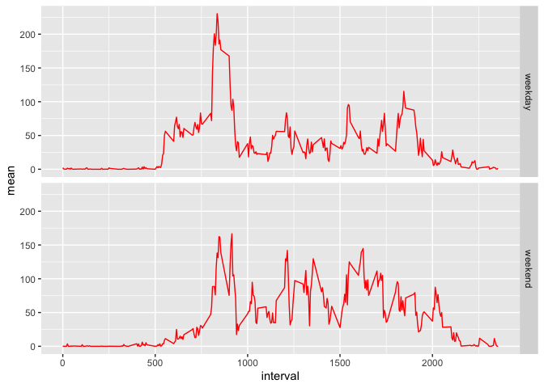

## Loading and preprocessing the data
data is read from the activity.csv file and loaded into the activity dataframe

```r
activity <- read.csv("activity.csv")
library(dplyr)
```

```
## 
## Attaching package: 'dplyr'
```

```
## The following objects are masked from 'package:stats':
## 
##     filter, lag
```

```
## The following objects are masked from 'package:base':
## 
##     intersect, setdiff, setequal, union
```

```r
steps <- group_by(activity, date) %>% 
        summarise(total = sum(steps), mean = mean(steps, na.rm = T), 
                  median = median(steps))
```

```
## `summarise()` ungrouping output (override with `.groups` argument)
```


## What is the mean total number of steps taken per day?


```r
hist(steps$total, breaks = 20, xlab = "Total Steps in a Day",
     col = "wheat", border = "red",
     main = "Histogram of the Total Number of Steps Taken per Day")
```

<!-- -->
The total number, mean and median number of steps each day are presented in the following table.

```r
head(steps, 10)
```

```
## # A tibble: 10 x 4
##    date       total    mean median
##    <chr>      <int>   <dbl>  <dbl>
##  1 2012-10-01    NA NaN         NA
##  2 2012-10-02   126   0.438      0
##  3 2012-10-03 11352  39.4        0
##  4 2012-10-04 12116  42.1        0
##  5 2012-10-05 13294  46.2        0
##  6 2012-10-06 15420  53.5        0
##  7 2012-10-07 11015  38.2        0
##  8 2012-10-08    NA NaN         NA
##  9 2012-10-09 12811  44.5        0
## 10 2012-10-10  9900  34.4        0
```

## What is the average daily activity pattern?
The following line graph represents a tracing of the average number of steps taken during each interval. We can see that there is little activity in the first 500 minutes, likely representing sleep. There is an initial spike in activity followed by a baseline activity that then trails off.

```r
library(ggplot2)
interval <- group_by(activity, interval) %>%
              summarise(mean = mean(steps, na.rm = T))
```

```
## `summarise()` ungrouping output (override with `.groups` argument)
```

```r
g <- ggplot(interval, aes(interval, mean))
g + geom_line(col = "red") + 
    labs(title = "Mean Steps per Interval", y = "Mean Steps", x = "Interval")
```

<!-- -->

The interval with the maximum number of steps was:

```r
interval$interval[which(interval$mean == max(interval$mean))]
```

```
## [1] 835
```

## Imputing missing values
Number of missing values

```r
sum(is.na(activity$steps))
```

```
## [1] 2304
```

Missing values were added based on the average interval value and the table represents the new number of steps during each interval with the values added.

```r
new.activity <- activity
for (i in 1:length(new.activity$steps)) {
    if (is.na(new.activity$steps[i])) {
        inter <- new.activity$interval[i]
        x <- interval$mean[which(interval$interval == inter)]
        new.activity$steps[i] <- x
    }
}
head(new.activity, 10)
```

```
##        steps       date interval
## 1  1.7169811 2012-10-01        0
## 2  0.3396226 2012-10-01        5
## 3  0.1320755 2012-10-01       10
## 4  0.1509434 2012-10-01       15
## 5  0.0754717 2012-10-01       20
## 6  2.0943396 2012-10-01       25
## 7  0.5283019 2012-10-01       30
## 8  0.8679245 2012-10-01       35
## 9  0.0000000 2012-10-01       40
## 10 1.4716981 2012-10-01       45
```
This histogram represents the counts of the new total number of steps taken each day after missing values were replaced.

```r
new.steps <- group_by(new.activity, date) %>% 
  summarise(total = sum(steps), mean = mean(steps, na.rm = T), 
            median = median(steps))
```

```
## `summarise()` ungrouping output (override with `.groups` argument)
```

```r
hist(new.steps$total, breaks = 20, xlab = "Total Steps in a Day",
     col = "wheat", border = "red",
     main = "Histogram of the Total Number of Steps Taken per Day")
```

<!-- -->

The new total, mean and median are shown in this table after missing values are added.

```r
head(new.steps, 10)
```

```
## # A tibble: 10 x 4
##    date        total   mean median
##    <chr>       <dbl>  <dbl>  <dbl>
##  1 2012-10-01 10766. 37.4     34.1
##  2 2012-10-02   126   0.438    0  
##  3 2012-10-03 11352  39.4      0  
##  4 2012-10-04 12116  42.1      0  
##  5 2012-10-05 13294  46.2      0  
##  6 2012-10-06 15420  53.5      0  
##  7 2012-10-07 11015  38.2      0  
##  8 2012-10-08 10766. 37.4     34.1
##  9 2012-10-09 12811  44.5      0  
## 10 2012-10-10  9900  34.4      0
```

## Are there differences in activity patterns between weekdays and weekends?

```r
new.activity$date <- as.Date(new.activity$date)
for (i in 1:length(new.activity$date)) {
    if (weekdays(new.activity$date[i]) %in% c("Saturday", "Sunday")){
        new.activity$weekday[i] <- "weekend"
    } else new.activity$weekday[i] <- "weekday"
}
new.activity$weekday <- as.factor(new.activity$weekday)
new.interval <- group_by(new.activity, interval, weekday) %>%
    summarise(mean = mean(steps, na.rm = T))
```

```
## `summarise()` regrouping output by 'interval' (override with `.groups` argument)
```

```r
gnew <- ggplot(new.interval, aes(interval, mean))
gnew + geom_line(col = "red") + facet_grid(weekday ~ .)
```

<!-- -->

```r
  labs(title = "Mean Steps per Interval", y = "Mean Steps", x = "Interval")
```

```
## $y
## [1] "Mean Steps"
## 
## $x
## [1] "Interval"
## 
## $title
## [1] "Mean Steps per Interval"
## 
## attr(,"class")
## [1] "labels"
```

The above graph shows the difference in activity between weekdays and weekends. It appears that activity starts later on the weekend and shows less of an initial peak. Activity is spread more evenly through the day on weekends and carries on a bit later than on weekdays.

